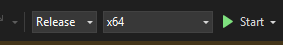
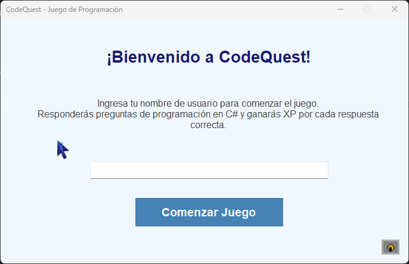
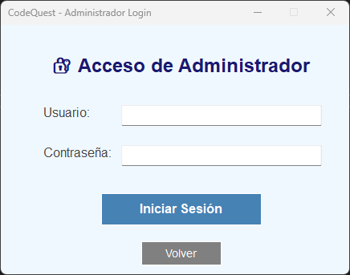
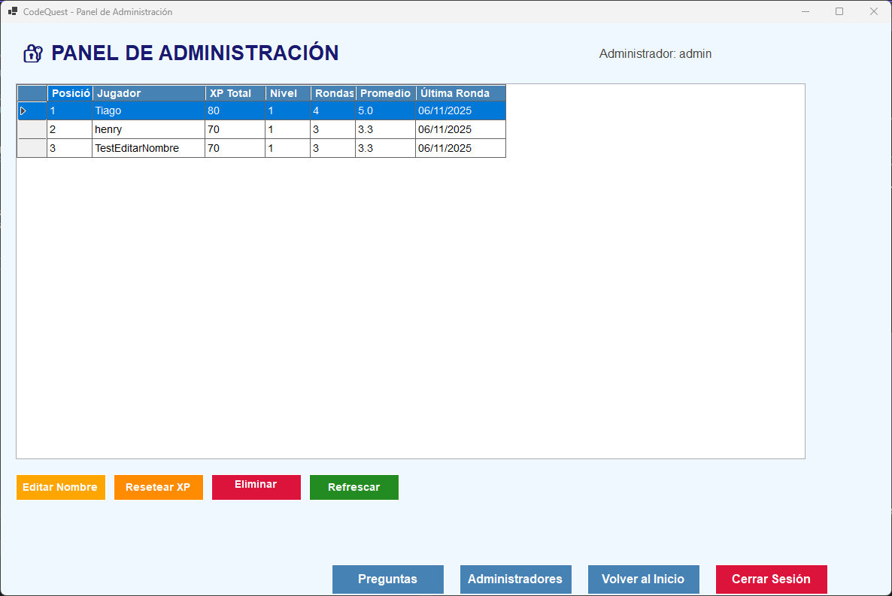
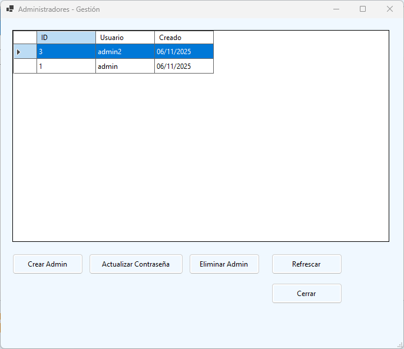
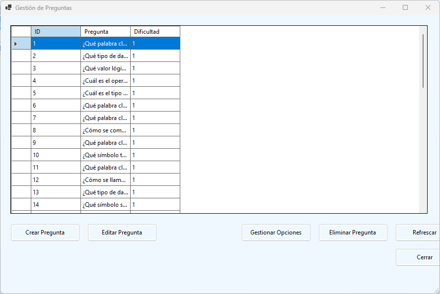
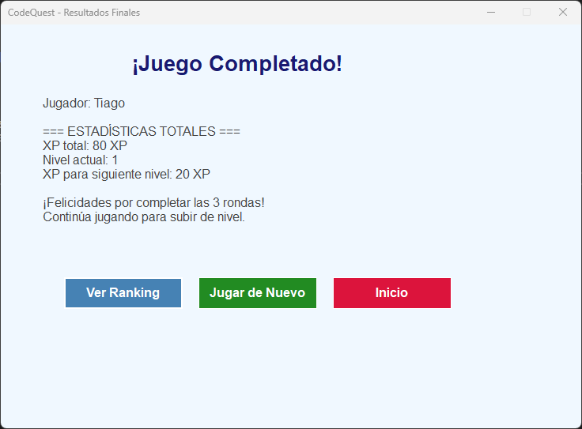
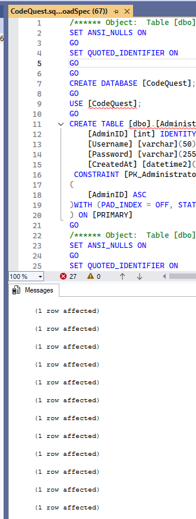
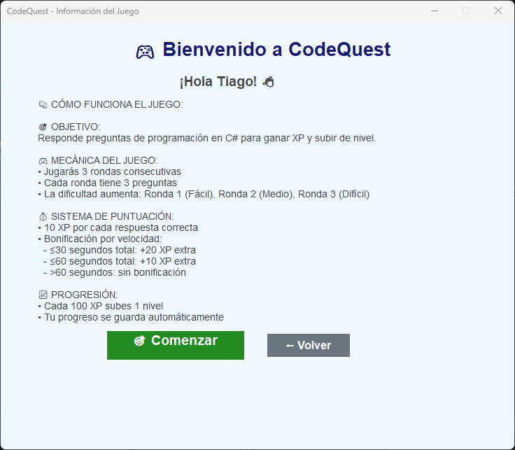
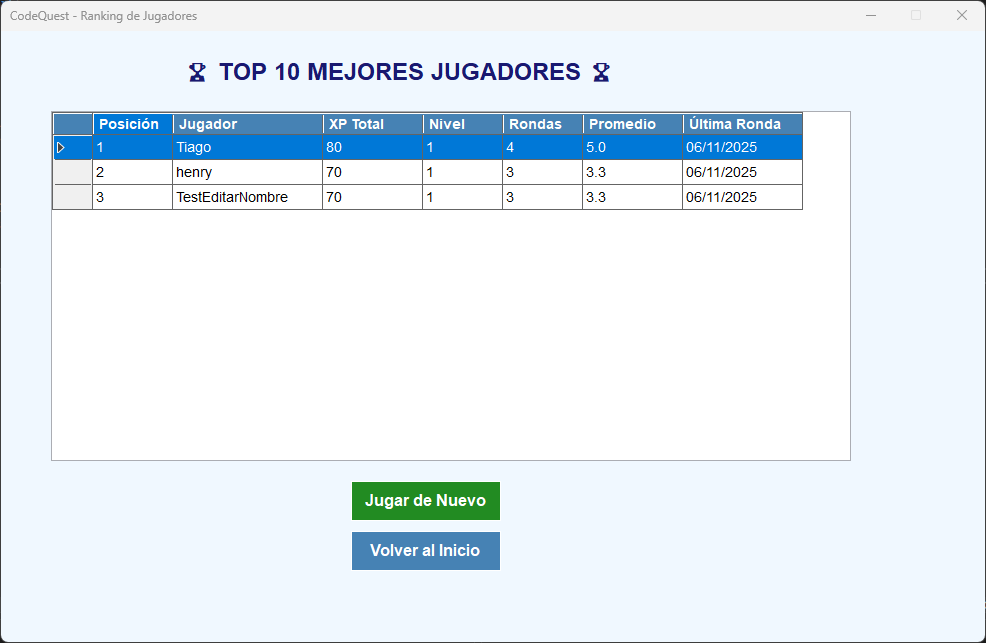

# CodeQuest

CodeQuest es una aplicacion de escritorio para Windows, desarrollada en C# y .NET, que permite administrar y jugar un cuestionario enfocado en conocimiento de desarrollo.
La solucion utiliza patrones de diseno modernos (repositorio, servicios y factory) y una base de datos SQL local.

Tabla de contenido

- Descripcion general
- Tecnologias
- Requisitos
- Instalacion y ejecucion
- Base de datos
- Arquitectura y componentes principales
- Estructura del proyecto

Descripcion general

CodeQuest permite gestionar jugadores, administradores, preguntas y rondas, y tocar la logica.

A continuacion se describen los componentes principales y la estructura del proyecto.

Tecnologias

- Lenguaje: C#
- Plataforma: .NET 8.0 para Windows
- Interfaz: Windows Forms
- Almacenamiento: SQL Server LocalDB (archivo CodeQuest.sql)
- Patrones: Repositorio, Servicios y Factory (DI)

Requisitos

- .NET SDK 8.0 o superior (Windows)
- Windows 10/11
- SQL Server LocalDB o SQL Server Express

Instalacion y ejecucion

- Opcion 1: Abrir la solucion en Visual Studio y sincronizar paquetes, luego ejecutar.
- Opcion 2: Siguientes comandos:
  - dotnet restore
  - dotnet build CodeQuest.sln
  - dotnet run --project CodeQuest.csproj

Base de datos

- El esquema se encuentra en [`Database/CodeQuest.sql`](Database/CodeQuest.sql)
- Inicializar la base de datos ejecutando ese archivo en su servidor
- La cadena de conexion se define en [`Database/DbConnection.cs`](Database/DbConnection.cs)

Arquitectura y componentes principales

CodeQuest implementa:

- Repositorios para el acceso a datos: [`Repositories/QuestionRepository.cs`](Repositories/QuestionRepository.cs) y [`Repositories/AdministratorRepository.cs`](Repositories/AdministratorRepository.cs)
- Servicios de negocio: [`Services/GameService.cs`](Services/GameService.cs), [`Services/AdministratorService.cs`](Services/AdministratorService.cs) y [`Services/IGameService.cs`](Services/IGameService.cs)
- Interfaces de repositorio y servicio: [`Repositories/IQuestionRepository.cs`](Repositories/IQuestionRepository.cs), [`Services/IGameService.cs`](Services/IGameService.cs)
- Fábrica de servicios (inyeccion de dependencias): [`Factories/ServiceFactory.cs`](Factories/ServiceFactory.cs)
- Interfaz y logicas de la UI: FormLogin.cs, FormStart.cs, FormQuestionManagement.cs, FormQuestions.cs, FormFinalResults.cs, FormRanking.cs, FormInformation.cs, FormAdminManagement.cs, FormAdminLocker.cs, FormManageOptions.cs
- Punto de entrada y proyecto: [`Program.cs`](Program.cs) y [`CodeQuest.csproj`](CodeQuest.csproj)

Estructura del proyecto

- Carpeta Database: [`Database/CodeQuest.sql`](Database/CodeQuest.sql)
- Carpeta Models: [`Models/Administrator.cs`](Models/Administrator.cs), [`Models/Question.cs`](Models/Question.cs), [`Models/User.cs`](Models/User.cs), [`Models/Round.cs`](Models/Round.cs)
- Carpeta Repositories: [`Repositories/IQuestionRepository.cs`](Repositories/IQuestionRepository.cs), [`Repositories/QuestionRepository.cs`](Repositories/QuestionRepository.cs), [`Repositories/IAdministratorRepository.cs`](Repositories/IAdministratorRepository.cs), [`Repositories/AdministratorRepository.cs`](Repositories/AdministratorRepository.cs)
- Carpeta Services: [`Services/IGameService.cs`](Services/IGameService.cs), [`Services/GameService.cs`](Services/GameService.cs), [`Services/IAdministratorService.cs`](Services/IAdministratorService.cs), [`Services/AdministratorService.cs`](Services/AdministratorService.cs)
- Carpeta Factories: [`Factories/ServiceFactory.cs`](Factories/ServiceFactory.cs)
- Formas de UI: FormLogin.cs, FormStart.cs, FormQuestionManagement.cs, FormQuestions.cs, FormFinalResults.cs, FormRanking.cs, FormInformation.cs, FormAdminManagement.cs, FormAdminLocker.cs, FormManageOptions.cs, FormQuestionManagement.cs
- Archivo de entrada: [`Program.cs`](Program.cs)
- Solucion: [`ProyectoFinalHerramientasII.sln`](ProyectoFinalHerramientasII.sln)

Guía paso a paso (tour visual)

Pre: 

Modos de Inicio del software:

A. Modo 1

  
   [`Screenshots/iniciaropcion1.png`](Screenshots/iniciaropcion1.png:1)

B. Modo 2

 
   [`Screenshots/iniciaropcion2.png`](Screenshots/iniciaropcion2.png:1)

1. Inicio — Pantalla principal
   Una vista rápida del inicio de la aplicación y navegación principal.

    
   [`Screenshots/inicio.png`](Screenshots/inicio.png:1)

2. Inicio de sesión — Acceso de usuarios y administradores
   Verifica credenciales y accede a las opciones.

    
   [`Screenshots/login.png`](Screenshots/login.png:1)

3. Panel de administración — Control central
   Desde aquí se gestiona el acceso a módulos de administración.

    
   [`Screenshots/paneladmin.png`](Screenshots/paneladmin.png:1)

4. Gestión de administradores y opciones
   Crear/editar administradores y configurar opciones del sistema.

    
   [`Screenshots/gestoradmin.png`](Screenshots/gestoradmin.png:1)

5. Gestión de preguntas
   Añade, edita y organiza preguntas y categorías.

    
   [`Screenshots/gestorpreguntas.png`](Screenshots/gestorpreguntas.png:1)

6. Juego — Inicio y desarrollo de una ronda
   Muestra del flujo de juego (opciones de inicio y pantalla de ronda).

    
   [`Screenshots/iniciaropcion1.png`](Screenshots/ronda.png:1)

7. Resultados finales y pantalla de ronda
   Resumen de puntajes y detalles de la ronda finalizada.

    
   [`Screenshots/resultados.png`](Screenshots/resultados.png:1)

8. Base de datos y carga de scripts
   Visual del esquema y la herramienta de carga de scripts.

    
   [`Screenshots/scriptDB.png`](Screenshots/scriptDB.png:1)
    
   [`Screenshots/cargascript.png`](Screenshots/cargascript.png:1)

9. Información y Ranking
   Páginas informativas y listado de ranking de usuarios.

    
   [`Screenshots/informacion.png`](Screenshots/informacion.png:1)

    
   [`Screenshots/rankingusuario.png`](Screenshots/rankingusuario.png:1)

(Nota: las imágenes se muestran como miniaturas grandes en el README; haz clic en el enlace de cada paso para abrir el archivo original en la carpeta [`Screenshots`](Screenshots:1).)
Contribucion

